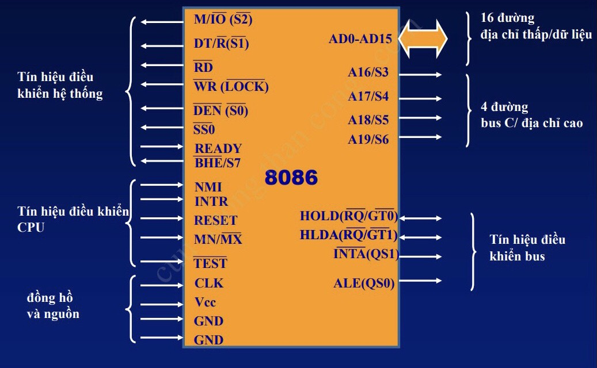
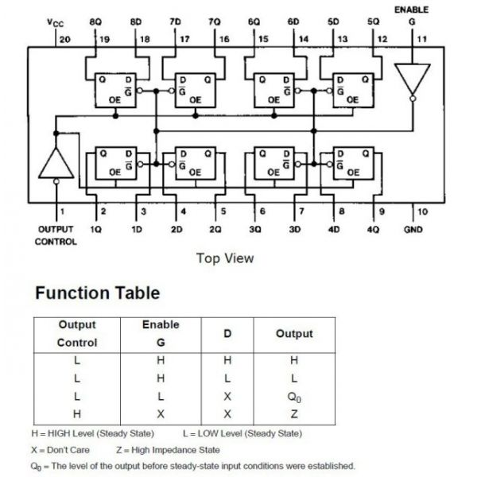
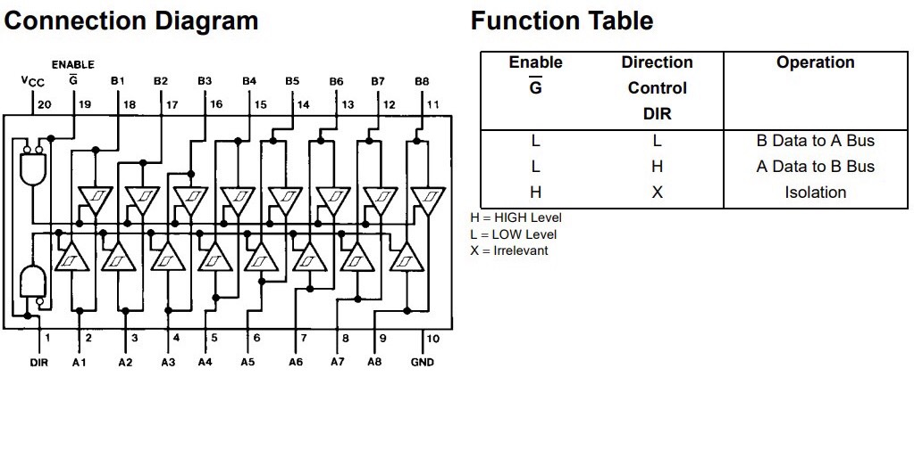
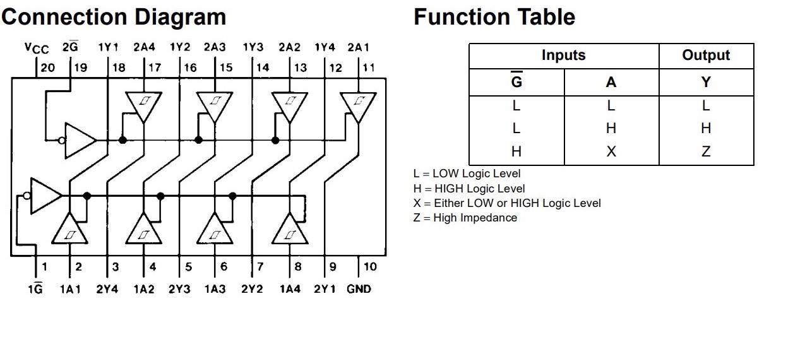
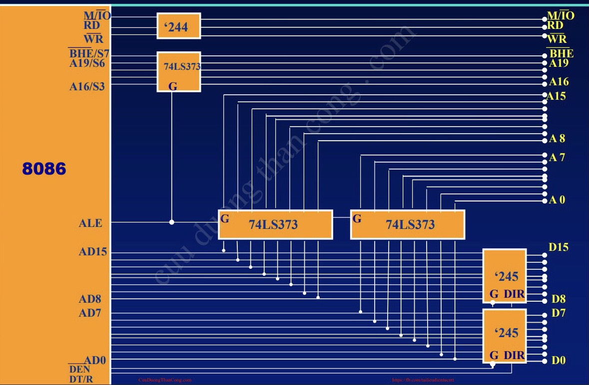

# Chương 4: Tổ chức vào ra dữ liệu

---

## 4.1 Các tín hiệu của 8088/8086 và các mạch phụ trợ 8284, 8288

 

- Bus dữ liệu của 8086 là 16 bit (từ AD0 đến AD15 là các chân tín hiệu dồn kênh địa chỉ và dữ liệu, các chân này vừa mang tín hiệu địa chỉ vừa mang tín hiệu dữ liệu).
- Bus dữ liệu của 8088 là 8 bit (từ AD0 đến AD7), số chân tín hiệu địa chỉ còn lại của 8088 từ A8 đến A19.
- Từ A16/S3 đến A19/S6 vừa mang tín hiệu địa chỉ vừa mang tín hiệu trạng thái (A16-A19 mang tín hiệu địa chỉ, S3-S6 mang tín hiệu trạng thái). Khi nào trên các chân tín hiệu này mang tín hiệu địa chỉ hay mang tín hiệu trạng thái sẽ được quy định bởi chân ALE.

 

### 4.1.1 Các chân tín hiệu của 8086

 

- **Nhóm chân tín hiệu dồn kênh (AD0-AD15)**: Các chân này vừa mang tín hiệu địa chỉ vừa mang tín hiệu dữ liệu. Chân ALE sẽ quyết định khi nào các chân này sẽ mang tín hiệu địa chỉ hoặc mang tín hiệu dữ liệu (Xem "Nhóm chân tín hiệu điều khiển bus")
   

- **Nhóm chân tín hiệu dồn kênh (A16/S3-A19/S6)**: Các chân này vừa mang tín hiệu địa chỉ vừa mang tín hiệu trạng thái. Chân ALE sẽ quyết định khi nào các chân này sẽ mang tín hiệu địa chỉ hoặc mang tín hiệu trạng thái:
   

  > - Khi ALE = 1 thì AD0-AD15 sẽ mang tín hiệu địa chỉ, khi ALE = 0 thì AD0-AD15 sẽ mang tín hiệu trạng thái.
  > - S3 và S4 là các bit trạng thái về thanh ghi đoạn đang truy cập:
  >   |S3|S4|Thanh ghi đoạn|
  >   |--|--|--------------|
  >   |0|0|ES|
  >   |0|1|SS|
  >   |1|0|CS or No|
  >   |1|1|DS|
  > - S5 là trạng thái của IF.
  > - S6 luôn bằng 1.

- **Nhóm chân tín hiệu điều khiển hệ thống** (Khi chân MN/MX = 1 thì 8086 sẽ hoạt động ở chế độ MIN, chân MN/MX = 0 thì 8086 sẽ hoạt động ở chế độ MAX):
   
  > - Khi chân **M/IO** có tín hiệu bằng 1 thì 8086 sẽ làm việc với bộ nhớ, bằng 0 thì 8086 sẽ làm việc với các thiết bị ngoại vi
  > - Chân **DT/R** là chân điều khiển chiều truyền dữ liệu trên bus dữ liệu của 8086, quyết định tín hiệu sẽ đi ra hay đi vào CPU
  > - Chân **RD** = 0 đưa tín hiệu yêu cầu đọc ra ngoài bộ nhớ hay thiết bị ngoại vi để thông báo rằng CPU đang cần đọc dữ liệu vào
  > - Chân **WR** = 0 đưa tín hiệu yêu cầu ghi để thông báo rằng CPU đang cần ghi dữ liệu ra ngoài bộ nhớ hay thiết bị ngoại vi
  > - Chân **DEN** = 0 thông báo rằng đã có các tín hiệu ổn định trên các chân tín hiệu dữ liệu của 8086
  > - Chân **READY**:
  >   - READY = 1 thì 8086 sẽ thực hiện quá trình đọc ghi mà không cần chèn thêm các chu kì đợi đợi nào.
  >   - READY = 0 thì 8086 sẽ chèn thêm các chu kì đợi (trong trường hợp tốc độ xử lí của bộ nhớ hay thiết bị ngoại vi chậm hơn tốc độ xử lí của 8086) để chờ cho đến khi mạch ngoài đã sẵn sàng cho quá trình trao đổi dữ liệu.
  > - Chân BHE/S7:
  >   - Khi ALE = 1 thì chân này sẽ ở trạng thái BHE (BHE luôn bằng 0)
  >   - Khi ALE = 0 thì chân này sẽ ở trạng thái S7 (S7 luôn bằng 1)
- **Nhóm chân tín hiệu điều khiển CPU:**
   
  > - Chân **NMI** và chân **INTR**:
  >   - NMI: Ngắt cứng không che được
  >   - INTR: Ngắt cứng che được
  > - Chân **RESET**: Khởi động tại CPU
  > - Chân **MN/MX**: Chế độ MIN, MAX. Khi ở chế độ MAX, các chân M/IO, DT/R, DEN, WR sẽ có tên lần lượt là S2, S1, S0, LOCK. Ba chân S2, S1, S0 được dùng để điều khiển hệ thống bus:
  >   - Ghép nối với điều khiển bus 8288
  >     |S2|S1|S0|Chu kì điều khiển của bus|
  >     |--|--|--|-------------------------|
  >     |0|0|0|Chấp nhận yêu cầu ngắt|
  >     |0|0|1|Đọc thiết bị ngoại vi|
  >     |0|1|0|Ghi thiết bị ngoại vi|
  >     |0|1|1|Dừng|
  >     |1|0|0|Đọc mã lệnh|
  >     |1|0|1|Đọc bộ nhớ|
  >     |1|1|0|Ghi bộ nhớ|
  >     |1|1|1|bus rỗi|
  > - Chân **TEST**: Nếu trong chương trình của CPU mà có lệnh WAIT, lệnh WAIT đó sẽ kiểm tra trạng thái của chân TEST, nếu TEST = 1 thì sẽ chờ cho đến khi TEST = 0 để thực hiện lệnh tiếp theo của lệnh WAIT
- **Nhóm chân tín hiệu đồng hồ và nguồn:**
   
- **Nhóm chân tín hiệu điều khiển bus:**
   
  > - Chân **HOLD**: (Tín hiệu đi vào) Điều khiển tín hiệu treo hệ thống bus của mạch ngoài đưa vào CPU hay trao quyền điều khiển hệ thống bus cho mạch ngoài.
  > - Chân **HLDA**: (Tín hiệu đi ra) Gửi tín hiệu chấp nhận trao quyền điều khiển hệ thống bus ra mạch ngoài từ CPU.
  > - Chân **INTA**: Gửi tín hiệu ra mạch ngoài thông báo CPU chấp nhận yêu cầu ngắt trên các chân NIM và INTR.
  > - Chân **ALE**: Điều khiển các chân tín hiệu dồn kênh
  >   - Khi ALE = 1 thì AD0-AD15 sẽ mang tín hiệu địa chỉ.
  >   - Khi ALE = 0 thì AD0-AD15 (A16/S3-A19/S6) sẽ mang tín hiệu dữ liệu (trạng thái).

 

### 4.1.2 Phân kênh và đệm cho các bus

- **Vì sao cần phân kênh và khuếch đại đệm?**
  - Do các bus địa chỉ và dữ liệu dùng chung chân cho nên chúng ta cần phân kênh để tách các địa chỉ và dữ liệu về đúng bus của chúng.
  - Do bản thân linh kiện có nội trở dẫn đến suy hao trong quá trình truyền tín hiệu, điện áp đầu vào không đúng với tiêu chuẩn khiến tín hiệu chân khác trên các chân có khả năng bị sai cho nên chúng ta cần khuyếch đại đệm (Buffer).
- **Các vi mạch phân kênh và đệm:**

  - **74LS373**: phân kênh
     
    
     
  - **74LS245**: đệm dữ liệu 2 chiều
    
     
  - **74LS244**: đệm 3 trạng thái theo 1 chiều
    
     

- **Sơ đồ**

