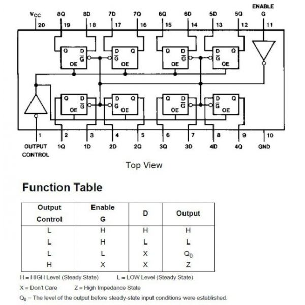

# Chương 4: Tổ chức vào ra dữ liệu

---

## 4.1 Các tín hiệu của 8088/8086 và các mạch phụ trợ 8284, 8288

 

- Bus dữ liệu của 8086 là 16 bit (từ AD0 đến AD15 là các chân tín hiệu dồn kênh địa chỉ và dữ liệu, các chân này vừa mang tín hiệu địa chỉ vừa mang tín hiệu dữ liệu).
- Bus dữ liệu của 8088 là 8 bit (từ AD0 đến AD7), số chân tín hiệu địa chỉ còn lại của 8088 từ A8 đến A19.
- Từ A16/S3 đến A19/S6 vừa mang tín hiệu địa chỉ vừa mang tín hiệu trạng thái (A16-A19 mang tín hiệu địa chỉ, S3-S6 mang tín hiệu trạng thái). Khi nào trên các chân tín hiệu này mang tín hiệu địa chỉ hay mang tín hiệu trạng thái sẽ được quy định bởi chân ALE.

 

#### 4.1.1 Các chân tín hiệu của 8086

 

 
Hình 4.1.1.1

- **Nhóm chân tín hiệu dồn kênh (AD0-AD15)**: Các chân này vừa mang tín hiệu địa chỉ vừa mang tín hiệu dữ liệu. Chân ALE sẽ quyết định khi nào các chân này sẽ mang tín hiệu địa chỉ hoặc mang tín hiệu dữ liệu (Xem "Nhóm chân tín hiệu điều khiển bus")
   

- **Nhóm chân tín hiệu dồn kênh (A16/S3-A19/S6)**: Các chân này vừa mang tín hiệu địa chỉ vừa mang tín hiệu trạng thái. Chân ALE sẽ quyết định khi nào các chân này sẽ mang tín hiệu địa chỉ hoặc mang tín hiệu trạng thái:
   

  > - Khi ALE = 1 thì AD0-AD15 sẽ mang tín hiệu địa chỉ, khi ALE = 0 thì AD0-AD15 sẽ mang tín hiệu trạng thái.
  > - S3 và S4 là các bit trạng thái về thanh ghi đoạn đang truy cập:
  >   |S3|S4|Thanh ghi đoạn|
  >   |--|--|--------------|
  >   |0|0|ES|
  >   |0|1|SS|
  >   |1|0|CS or No|
  >   |1|1|DS|
  > - S5 là trạng thái của IF.
  > - S6 luôn bằng 1.

- **Nhóm chân tín hiệu điều khiển hệ thống** (Khi chân MN/MX = 1 thì 8086 sẽ hoạt động ở chế độ MIN, chân MN/MX = 0 thì 8086 sẽ hoạt động ở chế độ MAX):
   
  > - Khi chân **M/IO** có tín hiệu bằng 1 thì 8086 sẽ làm việc với bộ nhớ, bằng 0 thì 8086 sẽ làm việc với các thiết bị ngoại vi
  > - Chân **DT/R** là chân điều khiển chiều truyền dữ liệu trên bus dữ liệu của 8086, quyết định tín hiệu sẽ đi ra hay đi vào CPU
  > - Chân **RD** = 0 đưa tín hiệu yêu cầu đọc ra ngoài bộ nhớ hay thiết bị ngoại vi để thông báo rằng CPU đang cần đọc dữ liệu vào
  > - Chân **WR** = 0 đưa tín hiệu yêu cầu ghi để thông báo rằng CPU đang cần ghi dữ liệu ra ngoài bộ nhớ hay thiết bị ngoại vi
  > - Chân **DEN** = 0 thông báo rằng đã có các tín hiệu ổn định trên các chân tín hiệu dữ liệu của 8086
  > - Chân **READY**:
  >   - READY = 1 thì 8086 sẽ thực hiện quá trình đọc ghi mà không cần chèn thêm các chu kì đợi đợi nào.
  >   - READY = 0 thì 8086 sẽ chèn thêm các chu kì đợi (trong trường hợp tốc độ xử lí của bộ nhớ hay thiết bị ngoại vi chậm hơn tốc độ xử lí của 8086) để chờ cho đến khi mạch ngoài đã sẵn sàng cho quá trình trao đổi dữ liệu.
  > - Chân BHE/S7:
  >   - Khi ALE = 1 thì chân này sẽ ở trạng thái BHE (BHE luôn bằng 0)
  >   - Khi ALE = 0 thì chân này sẽ ở trạng thái S7 (S7 luôn bằng 1)
- **Nhóm chân tín hiệu điều khiển CPU:**
   
  > - Chân **NMI** và chân **INTR**:
  >   - NMI: Ngắt cứng không che được
  >   - INTR: Ngắt cứng che được
  > - Chân **RESET**: Khởi động tại CPU
  > - Chân **MN/MX**: Chế độ MIN, MAX. Khi ở chế độ MAX, các chân M/IO, DT/R, DEN, WR sẽ có tên lần lượt là S2, S1, S0, LOCK. Ba chân S2, S1, S0 được dùng để điều khiển hệ thống bus:
  >   - Ghép nối với điều khiển bus 8288
  >     |S2|S1|S0|Chu kì điều khiển của bus|
  >     |--|--|--|-------------------------|
  >     |0|0|0|Chấp nhận yêu cầu ngắt|
  >     |0|0|1|Đọc thiết bị ngoại vi|
  >     |0|1|0|Ghi thiết bị ngoại vi|
  >     |0|1|1|Dừng|
  >     |1|0|0|Đọc mã lệnh|
  >     |1|0|1|Đọc bộ nhớ|
  >     |1|1|0|Ghi bộ nhớ|
  >     |1|1|1|bus rỗi|
  > - Chân **TEST**: Nếu trong chương trình của CPU mà có lệnh WAIT, lệnh WAIT đó sẽ kiểm tra trạng thái của chân TEST, nếu TEST = 1 thì sẽ chờ cho đến khi TEST = 0 để thực hiện lệnh tiếp theo của lệnh WAIT
- **Nhóm chân tín hiệu đồng hồ và nguồn:**
   
- **Nhóm chân tín hiệu điều khiển bus:**
   
  > - Chân **HOLD**: (Tín hiệu đi vào) Điều khiển tín hiệu treo hệ thống bus của mạch ngoài đưa vào CPU hay trao quyền điều khiển hệ thống bus cho mạch ngoài.
  > - Chân **HLDA**: (Tín hiệu đi ra) Gửi tín hiệu chấp nhận trao quyền điều khiển hệ thống bus ra mạch ngoài từ CPU.
  > - Chân **INTA**: Gửi tín hiệu ra mạch ngoài thông báo CPU chấp nhận yêu cầu ngắt trên các chân NIM và INTR.
  > - Chân **ALE**: Điều khiển các chân tín hiệu dồn kênh
  >   - Khi ALE = 1 thì AD0-AD15 sẽ mang tín hiệu địa chỉ.
  >   - Khi ALE = 0 thì AD0-AD15 (A16/S3-A19/S6) sẽ mang tín hiệu dữ liệu (trạng thái).

 

#### 4.1.2 Phân kênh và đệm cho các bus

 

- **Vì sao cần phân kênh và khuếch đại đệm?**
  - Do các bus địa chỉ và dữ liệu dùng chung chân cho nên chúng ta cần phân kênh để tách các địa chỉ và dữ liệu về đúng bus của chúng.
  - Do bản thân linh kiện có nội trở dẫn đến suy hao trong quá trình truyền tín hiệu, điện áp đầu vào không đúng với tiêu chuẩn khiến tín hiệu chân khác trên các chân có khả năng bị sai cho nên chúng ta cần khuyếch đại đệm (Buffer).
- **Các vi mạch phân kênh và đệm:**

  - **74LS373**: phân kênh
     
    
     
    Hình 4.1.1.2
  - **74LS245**: đệm dữ liệu 2 chiều
     
    
     
    Hình 4.1.1.3
  - **74LS244**: đệm 3 trạng thái theo 1 chiều
     
    
     
    Hình 4.1.1.4

- **Sơ đồ**

 
Hình 4.1.1.5

#### 4.1.3 Mạch tạo xung nhịp 8284 và mạch điều khiển bus 8288

 
Hình 4.1.3.1

> - Do trong một hệ vi xử lý có nhiều cách mạch phụ trợ khác nhau, người ta cần xử dụng mạch tạo xung nhịp 8284 để đồng bộ xung clock cho tất cả các mạch trong hệ vi xử lý. Thêm vào đó nó còn có chức năng đồng bộ tín hiệu READY, RESET cho 8086
> - 8288 là mạch phụ trợ cho 8086 để điều khiển bus khi 8086 ở chế độ MAX

#### 4.1.4 Biểu đồ thời gian

- **Các kí hiệu trong biểu đồ thời gian**:
   

  - Theo chiều kim đồng hồ từ góc trên cùng bên trái:
     
    
     
    Hình 4.1.4.1
    - Từ 1.5V -> 2.4V
    - Từ 2.4V -> 1.5V
    - Từ 1.5V -> 0.45V
    - Từ 0.45V -> 1.5V
       
  - Theo chiều kim đồng hồ từ góc trên cùng bên trái:
     
    
     
    Hình 4.1.4.2
    - Kí hiệu dành cho nhóm chân tín hiệu từ S0 - S1 - S2
    - Tín hiệu dồn kênh
    - Từ tín hiệu có thả nổi đến tín hiệu có ý nghĩa
    - Từ tín hiệu có ý nghĩa đến tín hiệu thả nổi
       

- **Biểu đồ thời gian trong 8086**:
   
  
   
  Hình 4.1.4.3

  > - **Chu kì đọc**:
  >   - Tại chu kì T1, khi ALE từ mức thấp lên mức cao, các chân AD0-AD15 sẽ mang tín hiệu địa chỉ, A16/S3 - A19/S6 và BHE/S7 cũng sẽ mang tín hiệu địa chỉ.
  >   - Tại chu kì T2, khi ALE duy trì ở mức thấp, tín hiệu tại các chân AD0-AD15 sẽ được thả nổi, A16/S3 - A19/S6 và BHE/S7 sẽ mang tín hiệu trạng thái.
  >   - Tại chu kì T3, khi ALE duy trì ở mức thấp, các chân AD0-AD15 bắt đầu có các tín hiệu dữ liệu, A16/S3 - A19/S6 và BHE/S7 vẫn mang tín hiệu trạng thái. Chân DEN ở mức thấp sẽ bắt đầu quá trình đọc dữ liệu vào bộ nhớ (Nếu READY = 0, cuối chu kì T3 sẽ được chèn thêm các chu kì đợi cho đến khi READY = 1).
  >   - Tại chu kì T4, khi ALE duy trì ở mức thấp, tín hiệu tại các chân AD0-AD15 sẽ được thả nổi, A16/S3 - A19/S6 và BHE/S7 vẫn mang tín hiệu trạng thái. Chân DEN từ mức thấp lên mức cao để kết thúc quá trình đọc dữ liệu vào bộ nhớ.

   

  > - **Chu kì ghi**:
  >   - Tại chu kì T1, khi ALE từ mức thấp lên mức cao, các chân AD0-AD15 sẽ mang tín hiệu địa chỉ, A16/S3 - A19/S6 và BHE/S7 cũng sẽ mang tín hiệu địa chỉ. DEN từ mức cao xuống mức thấp.
  >   - Tại chu kì T2, khi ALE duy trì ở mức thấp, tín hiệu tại các chân AD0-AD15 sẽ mang tín hiệu địa chỉ, A16/S3 - A19/S6 và BHE/S7 sẽ mang tín hiệu trạng thái, DEN duy trì mức thấp
  >   - Tại chu kì T3, khi ALE duy trì ở mức thấp, các chân AD0-AD15 có các tín hiệu dữ liệu, A16/S3 - A19/S6 và BHE/S7 vẫn mang tín hiệu trạng thái. DEN duy trì mức thấp.
  >   - Tại chu kì T4, khi ALE duy trì ở mức thấp, tín hiệu tại các chân AD0-AD15 sẽ được thả nổi, A16/S3 - A19/S6 và BHE/S7 vẫn mang tín hiệu trạng thái. Chân DEN, và WR từ mức thấp lên mức cao để kết thúc quá trình ghi dữ liệu vào bộ nhớ.

## 4.2 Ghép nối 8088 với bộ nhớ

#### 4.2.1 Các loại bộ nhớ bán dẫn

- **SRAM**

  - Đặc điểm:
    - Bị mất dữ liệu khi mất nguồn
    - Nhanh
    - Liên tục tiêu thụ năng lượng
    - Kích thước 16 MBits
  - Ứng dụng:
    - Bộ nhớ nhỏ và nhanh (cache)
    - Không dùng cho các thiết bị chạy pin

- **DRAM**

  - Đặc điểm:
    - Rẻ, tuy nhiên việc điều khiển quá trình làm tươi làm tăng giá thành của DRAM
    - Chỉ tiêu thụ năng lượng trong quá trong quá trình làm tươi và truy nhập
    - Tương đối nhanh
    - Kích thước 4GBits
  - Ứng dụng:
    - Được dùng làm bộ nhớ chính trong các hệ vi xử lý

#### 4.2.2 Giải mã địa chỉ cho bộ nhớ

#### a) Giải mã địa chỉ cho bộ nhớ bằng cổng NAND

- **Ví dụ:** Ghép EPROM 2716 (2K \* 8) với 8088
  - Phân tích:
    - EPROM (2K \* 8) => xác định được 11 đường tín hiệu địa chỉ A10-A0 (Vì 2K = 2 \* 2^10 = 2^11). Với 11 đường tín hiệu địa chỉ sẽ xác định được 2K địa chỉ khác nhau, với 2K địa chỉ khác nhau sẽ chứa được 2K ô nhớ (mỗi ô nhớ 8 bit).
    - 8088 => như ta đã biết 8088 có 20 đường địa chỉ A19-A0
    - Ta cần chọn vùng nhớ 2K của EPROM trong 1M của 8088 => quy ước chọn vùng nhớ trên cùng dành cho ROM => chọn FF800H-FFFFFH (chứa đoạn khởi động FFFF0H-FFFFFH)
  - Thực hiện ghép nối:
     
    
     
    Hình 4.2.2.1
    - chân OE của 2716 sẽ nhận tín hiệu vào từ chân RD của 8088
    - các chân A0-A10 của 2716 sẽ nhận tín hiệu vào từ các bus địa chỉ A0-A10 của 8088
    - các chân D0-D7 của 2716 đưa tín hiệu ra các bus dữ liệu D0-D7 của 8088
    - các chân từ A19-A11 của 8088 bằng 1 cho nên chúng ta sử dụng cổng NAND cho vào chân CS của 2716 để làm nhiệm vụ chọn chip
    - Trong trường hợp này, 8088 đang trao đổi dữ liệu với bộ nhớ => cổng IO/M của 8088 bằng 0 => IO/M cần thông qua 1 cổng đảo để có mức logic bằng 1 => Tất cả mức logic bằng 1 nên sau khi thông qua cổng NAND, chúng ta có mức logic bằng 0 được đưa vào CS => Với CS bằng 0 thì 2716 sẽ được chọn để làm việc. (I wonder how, I wonder why)

#### b) Giải mã địa chỉ cho bộ nhớ dùng bộ giải mã

- **Ví dụ:** Dùng EPROM 2764 (8K \* 8) để ghép thành bộ nhớ 64K cho 8088 bắt đầu từ địa chỉ F0000H
  - Phân tích:
    - 2764 => Gồm 13 đường tín hiệu địa chỉ A0-A12
    - 8088 => Gồm 20 đường tín hiệu địa chỉ A0-A19
    - Địa chỉ bắt đầu là F0000H => địa chỉ kết thúc FFFFFH
    - Cần ghép 8 EPROM 2764 vì 64K = 8K \* 8
    - Xác định các vùng địa chỉ của 8 con chip:
       
      
       
      Hình 4.2.2.2
    - Cần giải mã vùng địa chỉ của 8 con chip? => Dùng mạch phụ trợ 74LS138 (Sử dụng đặc điểm của 74LS138 là đối với mỗi bộ giá trị ABC của 74LS138 chỉ có 1 đầu ra tích cực ở mức thấp hay bằng 0)
       
      
       
      Hình 4.2.2.3
  - Thực hiện ghép nối:
     
    
     
    Hình 4.2.2.4
    - chân OE của 2764 sẽ nhận tín hiệu vào từ chân RD của 8088
    - các chân A0-A12 của 2764 sẽ nhận tín hiệu vào từ các bus địa chỉ A0-A12 của 8088
    - các chân D0-D7 của 2764 đưa tín hiệu ra các bus dữ liệu D0-D7 của 8088
    - các chân CS (chọn chip) của 2764 sẽ được nhận tín hiệu từ các chân Y của 74LS138
    - các chân A,B,C của 74LS138 sẽ lần lượt được nhận tín hiệu từ các chân bus địa chỉ A13,A14, A15 của 8088. Vì với mỗi bộ giá trị của A13,A14,A15 ta sẽ xác định được duy nhất 1 vùng nhớ trong 8 vùng nhớ của các chip 2764 (Xem hình 4.2.2.2), đồng thời mỗi bộ giá trị của A,B,C chỉ có 1 đầu ra tích cực ở mức thấp (Xem hình 4.2.2.3). Hay nói cách khác, nếu nối A13,A14,A15 của 8088 với A,B,C của 74LS138 thì với mỗi bộ giá trị của A13,A14,A15 ta sẽ chọn được 1 trong 8 chip 2764 để hoạt động trong vùng nhớ đã xác định.
    - chân A16 của 8888 (bằng 1) ghép với chân G1 của 74LS138 để đảm bảo mức logic đầu vào của G1 luôn bằng 1 (Xem hình 4.2.2.3).
    - 8088 muốn trao đổi dữ liệu với bộ nhớ => cổng IO/M của 8088 phải bằng 0 => ta ghép IO/M với G2A để đảm bảo đầu vào của G2A luôn bằng 0 (Xem hình 4.2.2.3).
    - các chân A17,A18,A19 (bằng 1) đưa vào cổng NAND và ghép với G2B để đảm bảo đầu vào của G2B luôn bằng 0 (Xem hình 4.2.2.3).
    - Lưu ý: Vì các chân A16,A17,A18,A19 đều được không sử dụng và đều bằng 1 cho nên chúng ta hoàn toàn có thể đổi vị trí của chúng cho nhau, ví dụ thay vì dùng A16 để ghép với G1, ta có thể chọn A17, A18 hoặc A19.
